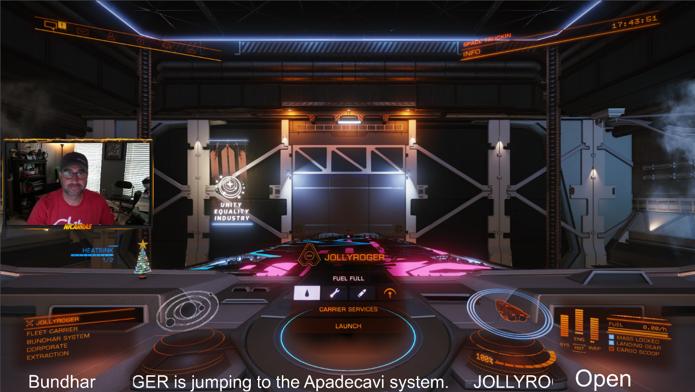

# Nicarras ED Stream Info

EDMC Plugin to export various ED Info to text files for use while streaming.

To use copy the 'NicEdInfo' folder into your EDMC plug-in directory. You can local this folder in the Plugins tab of EDMC settings.

NicEDInfo will use the EDMC default output folder for the files. Set this under the Output tab in the EDMC settings. Other output options do not need to be used, but this is the directory that will be used for output.

Current files created by the plugin
* system.txt - Current system you are in.
* mode.txt - Current mode/Private Group you are playing in.
* carrier_jump.txt - Message about your upcoming jump. Format - [Fleet Carrier Name] is jumping to the [System] system. This file is also emptied when the Jump is completed or cancelled.
* carrier_name.txt - The name of your Fleet Carrier without the ID on the end.

Example Usage in a Scene, use the text however you want!

